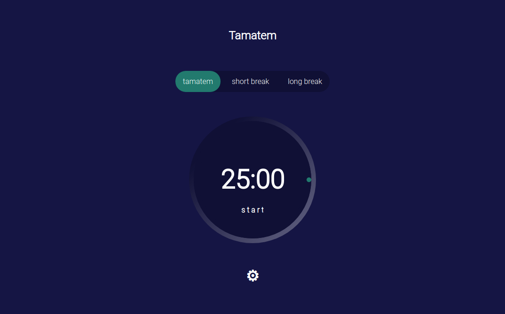
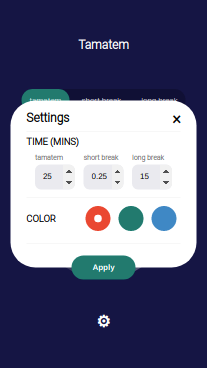
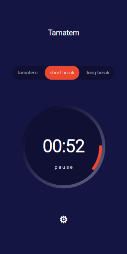
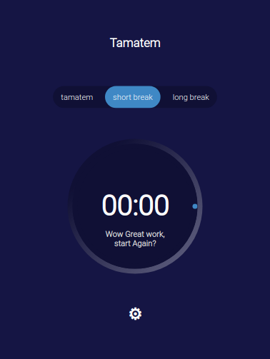

# Tamtem Timer 
Tamtem is a configurable timer that fits both desktop & mobile browser.
The aim of this app is to help you focus on any task you are working on, such as study, writing, or coding.

This app is designed with pure vanilla js 
Live Demo: https://codepen.io/el7ot/full/WNjgarB
Video Demo: https://youtu.be/KeJEeNMMFbE

Screenshots: 

  
